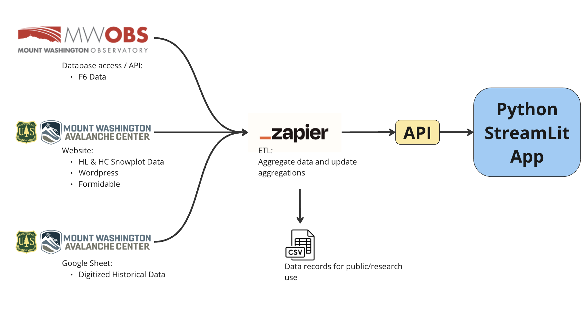

# Web-based Snowpack Visualization Toolkit 
## Mt. Washington Avalanche Center

### Project Overview




The Mt. Washington Snowpack Visualization App is a Python-based web application designed to provide an interactive and 
comprehensive view of the snowpack data collected by the Mt. Washington Avalanche Center (MWAC). This application integrates 
historical data from the Hermit Lake snowplot along with real-time field observations collected by the Avalanche Center 
staff, offering a valuable tool for researchers, climbers, and enthusiasts interested in the snow conditions of Mt. 
Washington.

## Features & Product Requirements

#### Product Features:
- **Interactive Data Visualization:** Utilizes Streamlit for an intuitive and interactive user interface.
- **Historical Data Analysis:** Access to historical snowpack data from the Hermit Lake snowplot.
- **Real-time Observations:** Integration of current field observations by the Avalanche Center staff.
- **Customizable Views:** Options to filter and analyze data based on various parameters.
- **Responsive Design:** Ensures compatibility with various devices and screen sizes.

#### Product Requirements: The user can select to plot a time series of one or more variables
- The user can alter the lookback window; from 1 day to entire winter
- The user can download all source data with a single click (ideally, able to filter certain years)
- The user can compare the current winter against the previous winter


## Installation

To run this application, you will need Python installed on your system. Clone the repository and install the required dependencies:

```bash
git clone https://github.com/danieljfeller/mwac.git
cd mwac
pip install -r requirements.txt
```

## Usage

To start the application, run:

```bash
streamlit run app.py
```

Navigate to the provided local URL in your web browser to interact with the application.

## National Weather Service Forecast API 

In the United States, api.weather.gov represents the data services available to the public from the National Weather Service.

Service Definition (OpenAPI v3.0/Swagger): https://api.weather.gov/openapi.json

1. Retreive metadata from the KMWN station at the Mount Washington Summit here:
https://api.weather.gov/points/44.27028000000007,-71.30332999999996

2. Receive a JSON document and find the forecast property inside the properties object
   - Find the hourly forecast from the forecastHourly property:
   - "https://api.weather.gov/gridpoints/GYX/37,81/forecast/hourly"

Gridpoint data information:
- Presented in JSON format
- Document contains data about the forecast grid, with multiple layers of data
- The data is presented as a time series, in an hourly format

Relevant available data layers:
- temperature
- dewpoint
- maxTemperature
- minTemperature
- relativeHumidity
- skyCover
- windDirection
- windSpeed
- weather
- quantitativePrecipitation
- snowfallAmount
- snowLevel
- iceAccumulation

## Contributing

Contributions to the Mt. Washington Snowpack Visualization App are welcome. Please follow these steps to contribute:

1. Fork the repository.
2. Create a new branch for your feature (`git checkout -b feature/AmazingFeature`).
3. Commit your changes (`git commit -m 'Add some AmazingFeature'`).
4. Push to the branch (`git push origin feature/AmazingFeature`).
5. Open a pull request.

## License

This project is released under the MIT License. See the [LICENSE](LICENSE.md) file for details.

## Acknowledgments

- Mt. Washington Avalanche Center for providing the data.
- Contributors and supporters of this project.


